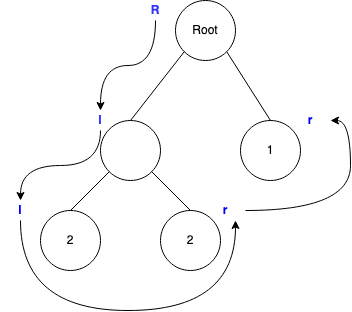

# Huffman compression

This project is a Java implementation of the Huffman coding algorithm.

## Getting started

First, clone this repository.

To run this program, simply do:

```
./gradlew run
```

or, on Windows:

```
.\gradlew run
```

The program has been tested on Windows 10 and macOS Big Sur.

## Implementation

Huffman coding algorithms compresses texts by assigning fewer bits to store characters that appear more often in the
source text. It generates a binary tree where more frequent characters are higher up in the tree.

In this implementation, instead of counting the frequencies of characters, it counts the frequencies of bytes in a given
byte array. Decompression works by traversing the resulting tree and reconstructing the byte array back.

The tree that is generated is stored at the start of the compressed file before the actual compressed content, by
serializing the tree into a compact format that takes up as little extra space as possible.

### Serialization format

The serialized tree is represented in bytes. In order to illustrate the format, however, more readable characters are
used to represent the special bytes in the serialized data.

Consider a simple binary tree with one root node and two child nodes under the root. The number `1` is stored in the
left node, and the number `2` is stored in the right node. It may be serialized into the following by the algorithm:

```
Rl1^r2
```

`R` stands for the root of the tree.
`l` and `r` (called the *direction code*) represents the left and right node of the previous node respectively. Anything
between a direction code and the next direction code represents the content of the node. If the node is empty, then a
direction code may immediately be followed by another code.

Consider the following serialized tree:

```
Rll2^r2^^r1
```

it can be visualized as follows:



In order to obtain the serialized format, the following procedures may be followed:

- Traverse the tree in a pre-order manner, marking down the direction of the node along the way.
- For every node that has content in it, also note down its content before visiting the next node.
- If the next node is at the same or at an upper level, add `^` equal to the difference between the current level and the next level plus 1.
  For example, if the next node is 2 levels up, add 3 `^` as such: `^^^`.
  If the difference is 0, add 1 `^`.
- If the next node is below the current node, no special notation is required.

Storing the serialized tree in string format induces additional overhead
(having to decode the underlying bytes into readable characters). Instead, the special notations like direction codes
are represented by negative numbers. The notations and the node content are then stored as `short`s. The following table
shows how the special notations are mapped to negative numbers:

| Notation | Corresponding number |
| -------- | -------------------- |
| `R`      | `-5`                 |
| `r`      | `-4`                 |
| `l`      | `-3`                 |
| `^`      | `-2`                 |

`-1` is not used because it is reserved to indicate EOF in Java.

## Books used

The following books are used to test the effectiveness of the algorithm.
They are available for free at [this website](https://www.gutenberg.org/).

- The Origin of Thought and Speech by M. Moncalm
- Jane Seton by James Grant
- A Revolução Portugueza: O 31 de Janeiro (Porto 1891) by Francisco Jorge de Abreu
- The Penitente Moradas of Abiquiú by Richard E. Ahlborn
- Germana by Edmond About
- La nariz de un notario by Edmond About

## Corpus dataset used

The following corpus datasets are used to test the effectiveness of the algorithm.
They are availble for free at [this website](http://pizzachili.dcc.uchile.cl/repcorpus.html).

- fib41
- dblp.xml.00001.1
- para
